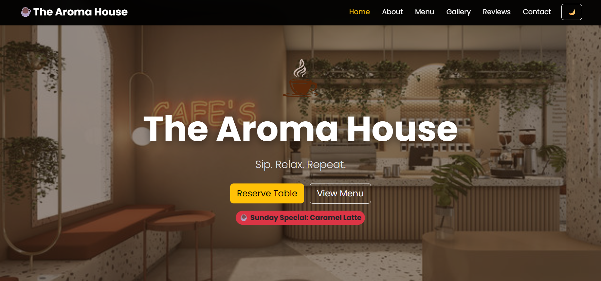
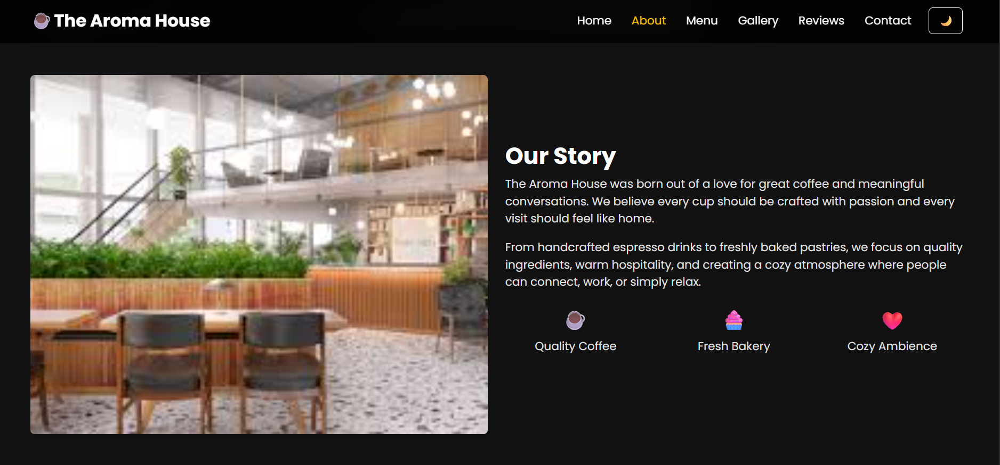
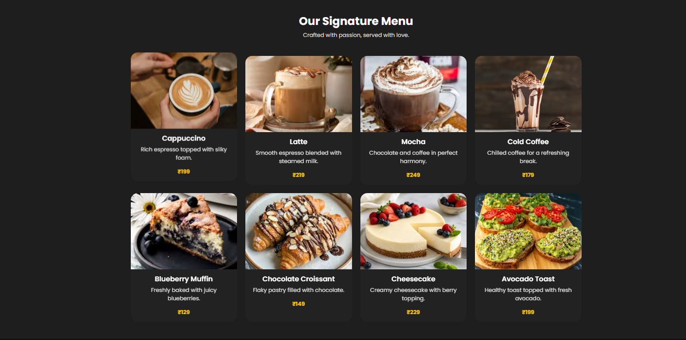
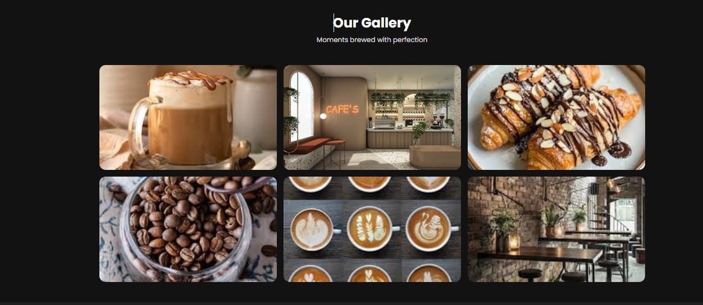
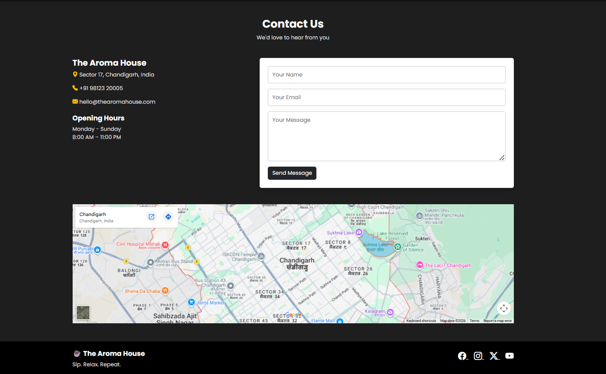
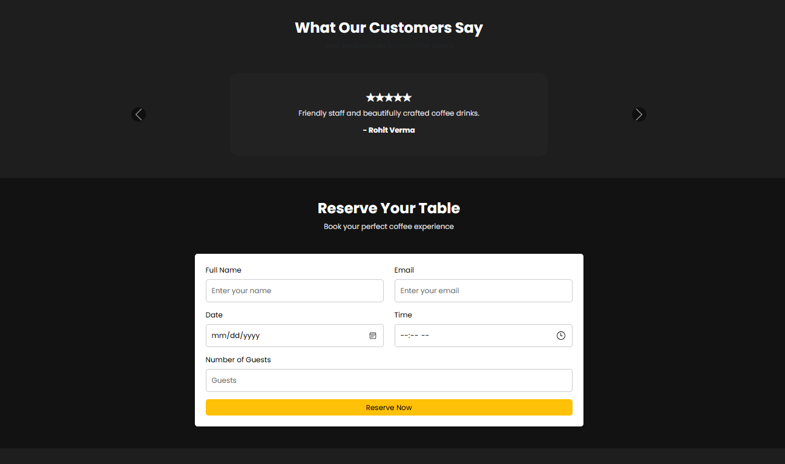

# ☕ The Arome House

A modern, responsive café website built using **HTML, CSS, JavaScript, and Bootstrap 5**. The website showcases a premium coffee shop experience with a stylish design, responsive layout, interactive gallery, testimonials, reservation system, and dark mode support.

## 🚀 Features

### Hero Section

* Café logo and tagline
* Reserve Table button
* View Menu button
* Dynamic "Today's Special" badge based on the current day

### About Section

* Café story
* Featured café image

### Menu Highlights

* 8 signature menu items
* Responsive Bootstrap cards
* Hover animations

### Gallery

* Responsive image grid
* Bootstrap modal lightbox

### Testimonials

* Customer reviews
* Bootstrap carousel

### Reservation System

* Table reservation form
* JavaScript validation

### Contact Section

* Contact information
* Contact form
* Embedded Google Map

### Extra Features

* Sticky navigation bar
* Smooth scrolling
* Active navigation highlighting
* Dark Mode Toggle (saved using localStorage)
* Responsive design for mobile, tablet, and desktop
* SEO meta tags

---

## 🛠️ Technologies Used

* HTML5
* CSS
* JavaScript (ES6)
* Bootstrap 5
* Bootstrap Icons

---

## 📁 Project Structure

The Aroma House/

├── index.html

├── index.css

├── script.js

└── assets/

    ├── logo.png

    ├── hero.jpeg

    ├── about.jfif

    ├── menu1.jpg ... menu8.jpg

    └── gallery1.jpg ... gallery6.jpg

---

## 📸 Screenshots

### Home Page

### About Section

### Menu Section

### Gallery Section

### Contact Section

### Reservation Section

---

## ▶️ How to Run

1. Download or clone the project.
2. Open the project folder.
3. Double-click `index.html`.

OR

Open using VS Code and run with **Live Server**.

---

## 📱 Responsive Design

The website is fully responsive and works on:

* Mobile Phones
* Tablets
* Laptops
* Desktop Screens

---

## 👩‍💻 Author

**Suhani Aggarwal**

Internship Project – Restaurant Landing Page

---

## 📄 License

This project is created for educational and internship purposes.
